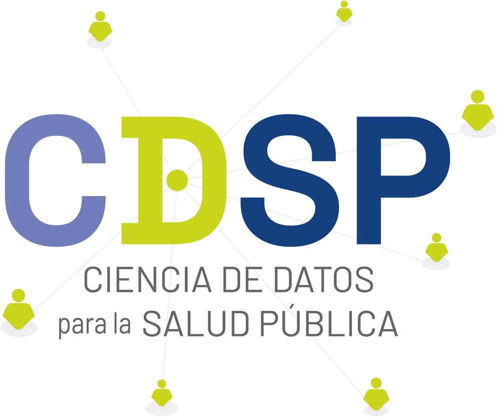

> **Language / Idioma:** **English** \|
> [Español](https://github.com/RodoTasso/ciecl/blob/main/README.md)

<!-- README generado desde README.Rmd. Editar este archivo, no los .md -->

# ciecl  

**Data Science for Public Health Group** \| University of Chile

<!-- badges: start -->

[](https://lifecycle.r-lib.org/articles/stages.html#stable)
[](https://CRAN.R-project.org/package=ciecl)
[](https://github.com/RodoTasso/ciecl/releases)
[](https://github.com/RodoTasso/ciecl/actions/workflows/r.yml)
[](https://cran.r-project.org/package=ciecl)
[](https://github.com/RodoTasso/ciecl/actions/workflows/test-coverage.yaml)
[](https://rodotasso.github.io/ciecl/)
[](https://github.com/ropensci/software-review/issues/765)
<!-- badges: end -->

**Official Chilean ICD-10 Classification (CIE-10) for R**.

Specialized package for searching, validating, and analyzing ICD-10
codes in the Chilean context. Includes the official MINSAL/DEIS v2018
catalogue with optimized search, comorbidity computation, and WHO ICD-11
API access.

## Purpose

`ciecl` facilitates working with ICD-10 codes in Chilean health research
and data analysis, avoiding manual Excel manipulation and providing
specialized tools for:

- Fast validation of diagnostic codes
- Typo-tolerant search (Jaro-Winkler fuzzy search)
- Automatic comorbidity indices (Charlson, Elixhauser)
- Optimized SQL queries over the complete catalogue
- Hierarchical expansion of categories (e.g., `E11` → `E11.0`, `E11.1`,
  …, `E11.9`)
- Access to the WHO ICD-11 API

## Features

- **Official Chilean CIE-10 catalogue** (MINSAL/DEIS v2018) embedded as
  a dataset
- **Jaro-Winkler fuzzy search** tolerant to typos
- **Chilean medical abbreviations** (IAM, EPOC, DM2, HTA, TBC, …)
- **Direct SQL queries** via SQLite + FTS5
- **Charlson/Elixhauser comorbidities** using `comorbidity`
- **WHO ICD-11 API** via `cie11_search()`
- **Robust normalization**: accepts `E110`, `E11.0`, `e 11 0`, `I10-0`,
  etc.
- **Minimal dependencies** (8 core packages; the rest in Suggests)

The dataset is established by [Decree
356/2017](https://www.bcn.cl/leychile/navegar?i=1112064) of Chile’s
Ministry of Health as the official disease classification. It is not
modifiable by the package; it can only be updated by MINSAL
institutional decree.

## Installation

``` r
# CRAN
install.packages("ciecl")

# GitHub (desarrollo)
# install.packages("pak")
pak::pak("RodoTasso/ciecl")
```

## Quick start

``` r
library(ciecl)

# Busqueda exacta por codigo
cie_lookup("E11.0")
#> # A tibble: 1 × 10
#>   codigo descripcion       categoria seccion capitulo_nombre inclusion exclusion
#>   <chr>  <chr>             <chr>     <chr>   <chr>           <chr>     <chr>    
#> 1 E11.0  Diabetes mellitu… E11 DIAB… E08-E1… Cap.04  ENFERM… <NA>      <NA>     
#> # ℹ 3 more variables: capitulo <chr>, es_daga <int>, es_cruz <int>

# Multiples codigos
cie_lookup(c("E11.0", "I10", "Z00"))
#> # A tibble: 3 × 10
#>   codigo descripcion       categoria seccion capitulo_nombre inclusion exclusion
#>   <chr>  <chr>             <chr>     <chr>   <chr>           <chr>     <chr>    
#> 1 E11.0  Diabetes mellitu… E11 DIAB… E08-E1… Cap.04  ENFERM… <NA>      <NA>     
#> 2 I10    Hipertensión ese… I10 HIPE… I10-I1… Cap.09  ENFERM… <NA>      <NA>     
#> 3 Z00    Examen general e… Z00 EXAM… Z00-Z1… Cap.21  FACTOR… <NA>      <NA>     
#> # ℹ 3 more variables: capitulo <chr>, es_daga <int>, es_cruz <int>

# Descripcion directa para usar en mutate()
cie_describe(c("E11.0", "I10"))
#> [1] "Diabetes mellitus tipo 2 con coma" "Hipertensión esencial (primaria)"

# Busqueda fuzzy tolerante a errores
cie_search("diabetis mellitus")
#> # A tibble: 50 × 4
#>    codigo descripcion                                            score categoria
#>    <chr>  <chr>                                                  <dbl> <chr>    
#>  1 E10    Diabetes mellitus insulinodependiente                    0.5 E10 DIAB…
#>  2 E10.0  Diabetes mellitus tipo 1 con coma                        0.5 E10 DIAB…
#>  3 E10.1  Diabetes mellitus tipo 1 con cetoacidosis                0.5 E10 DIAB…
#>  4 E10.2  Diabetes mellitus tipo 1 con complicaciones renales      0.5 E10 DIAB…
#>  5 E10.3  Diabetes mellitus tipo 1 con complicaciones oftálmicas   0.5 E10 DIAB…
#>  6 E10.4  Diabetes mellitus tipo 1 con complicaciones neurológi…   0.5 E10 DIAB…
#>  7 E10.5  Diabetes mellitus tipo 1 con complicaciones  circulat…   0.5 E10 DIAB…
#>  8 E10.6  Diabetes mellitus tipo 1 con otras complicaciones esp…   0.5 E10 DIAB…
#>  9 E10.7  Diabetes mellitus tipo 1 con complicaciones múltiples    0.5 E10 DIAB…
#> 10 E10.8  Diabetes mellitus tipo 1 con complicaciones no especi…   0.5 E10 DIAB…
#> # ℹ 40 more rows

# Siglas medicas chilenas
cie_search("IAM")
#> i Sigla detectada: IAM -> infarto agudo miocardio
#> # A tibble: 50 × 4
#>    codigo descripcion                                            score categoria
#>    <chr>  <chr>                                                  <dbl> <chr>    
#>  1 I21    Infarto agudo del miocardio                                1 I21 INFA…
#>  2 I21.0  Infarto transmural agudo del miocardio de la pared an…     1 I21 INFA…
#>  3 I21.1  Infarto transmural agudo del miocardio de la pared in…     1 I21 INFA…
#>  4 I21.2  Infarto agudo transmural del miocardio de otros sitios     1 I21 INFA…
#>  5 I21.3  Infarto transmural agudo del miocardio, de sitio no e…     1 I21 INFA…
#>  6 I21.4  Infarto subendocárdico agudo del miocardio                 1 I21 INFA…
#>  7 I21.9  Infarto agudo del miocardio, sin otra especificación       1 I21 INFA…
#>  8 I23    Ciertas complicaciones presentes posteriores al infar…     1 I23 CIER…
#>  9 I23.0  Hemopericardio como complicación presente posterior a…     1 I23 CIER…
#> 10 I23.3  Ruptura de la pared cardíaca sin hemopericardio como …     1 I23 CIER…
#> # ℹ 40 more rows
```

``` r
# Comorbilidades (requiere: install.packages("comorbidity"))
df |> cie_comorbid(id = "paciente", code = "diagnostico", map = "charlson")
```

## ICD-11 API (optional)

To use `cie11_search()` you need free WHO credentials
(<https://icd.who.int/icdapi>). We recommend storing them with the
`keyring` package:

``` r
keyring::key_set("ciecl_icd11")  # client_id:client_secret
Sys.setenv(ICD_API_KEY = keyring::key_get("ciecl_icd11"))
cie11_search("diabetes mellitus")
```

The CIE-10 functions (the core of the package) work without an API key.

## Data

Official **CIE-10 MINSAL/DEIS v2018** catalogue:

- Source: [DEIS](https://deis.minsal.cl) — [Centro FIC
  Chile](https://deis.minsal.cl/centrofic/)
- Public domain under [Decree
  356/2017](https://www.bcn.cl/leychile/navegar?i=1112064)

## Contributing

- Report bugs: <https://github.com/RodoTasso/ciecl/issues>
- Contribute: see `CONTRIBUTING.md`

## License

MIT + MINSAL public-domain data.

## Author

**Rodolfo Tasso Suazo** — <rtasso@uchile.cl> Data Science for Public
Health Group, School of Public Health, Faculty of Medicine, University
of Chile.

## Links

- Repository: <https://github.com/RodoTasso/ciecl>
- DEIS MINSAL: <https://deis.minsal.cl>
- ICD-11 API: <https://icd.who.int/icdapi>
